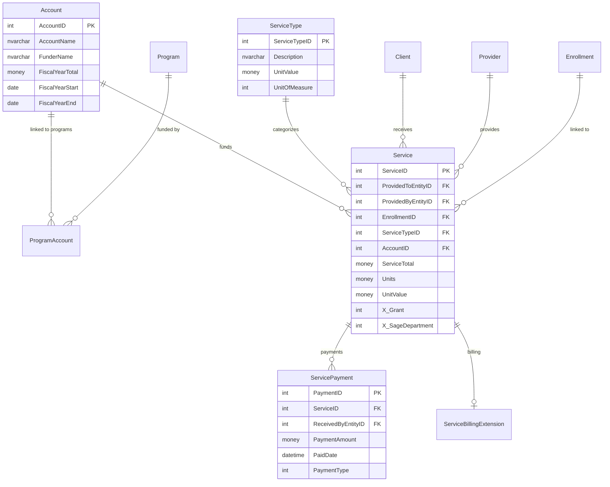
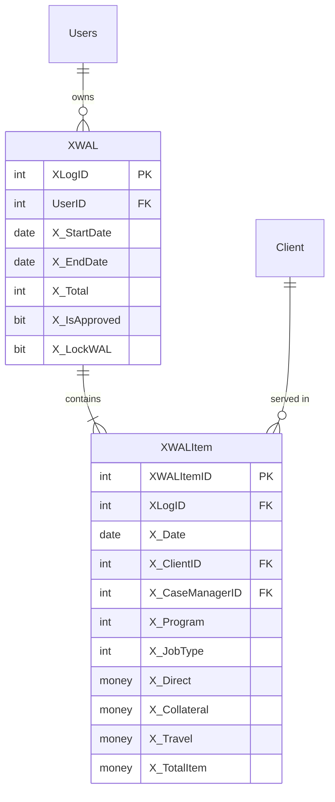
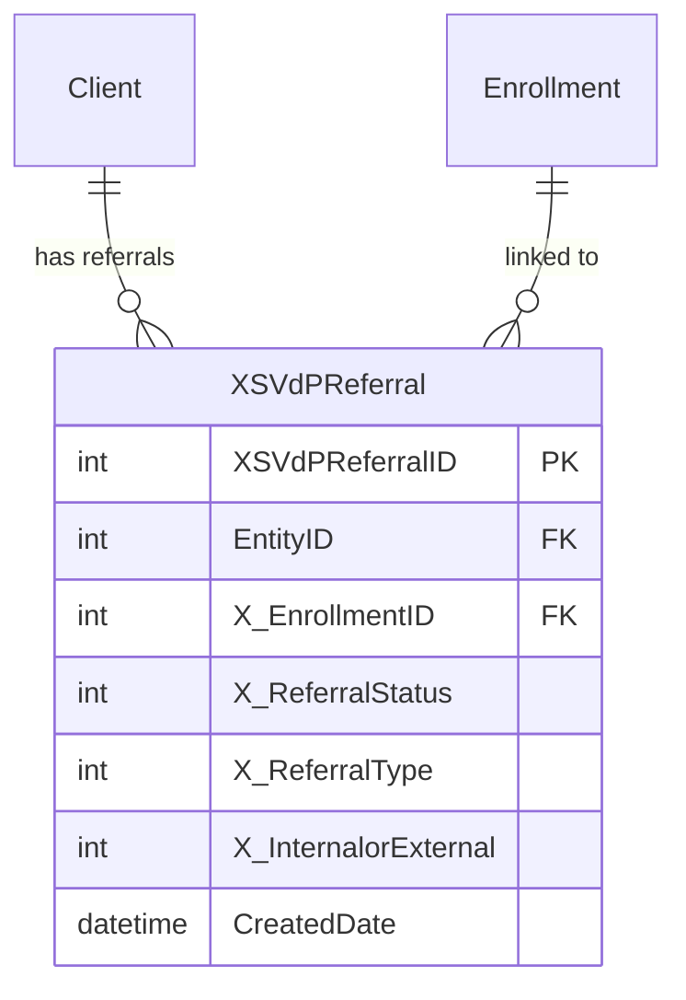
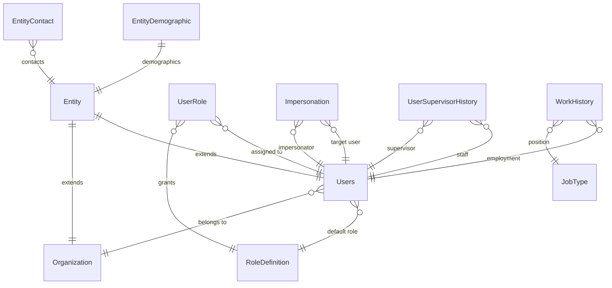
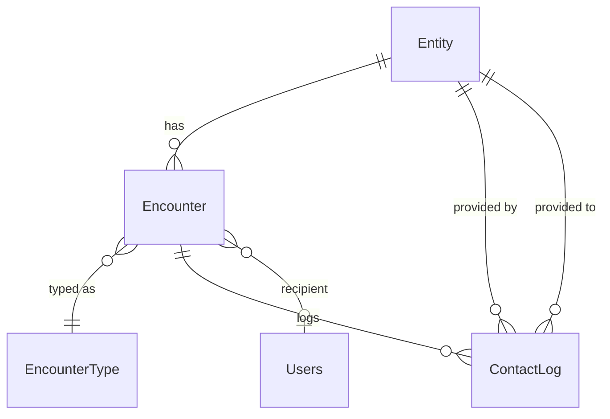
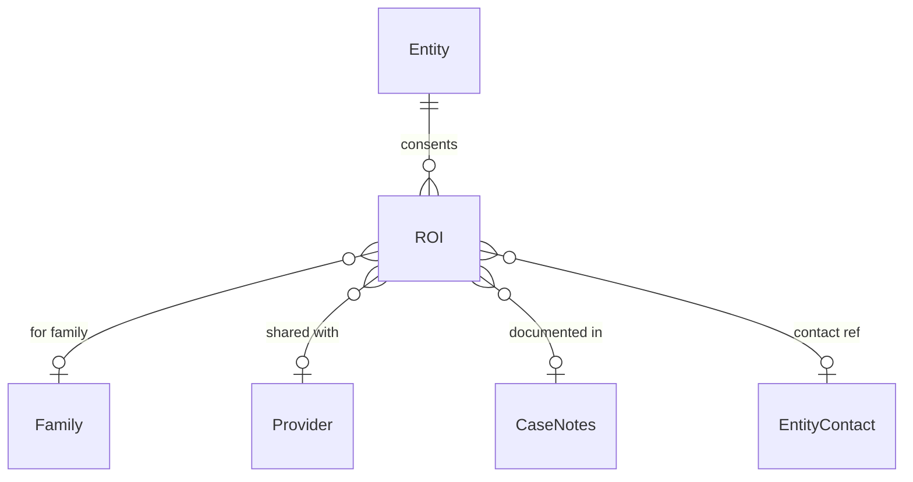
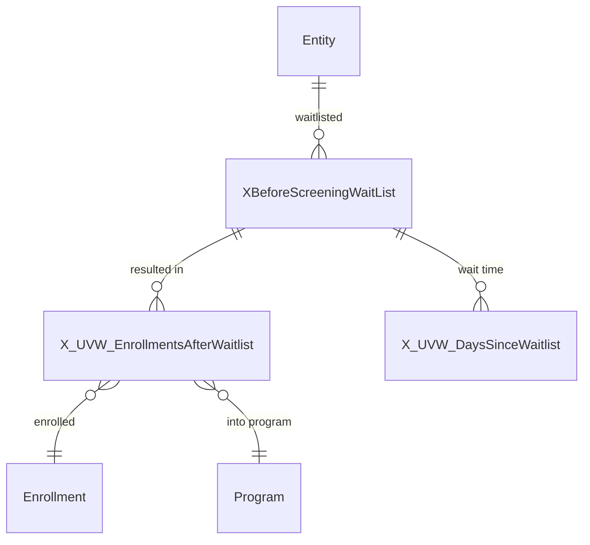
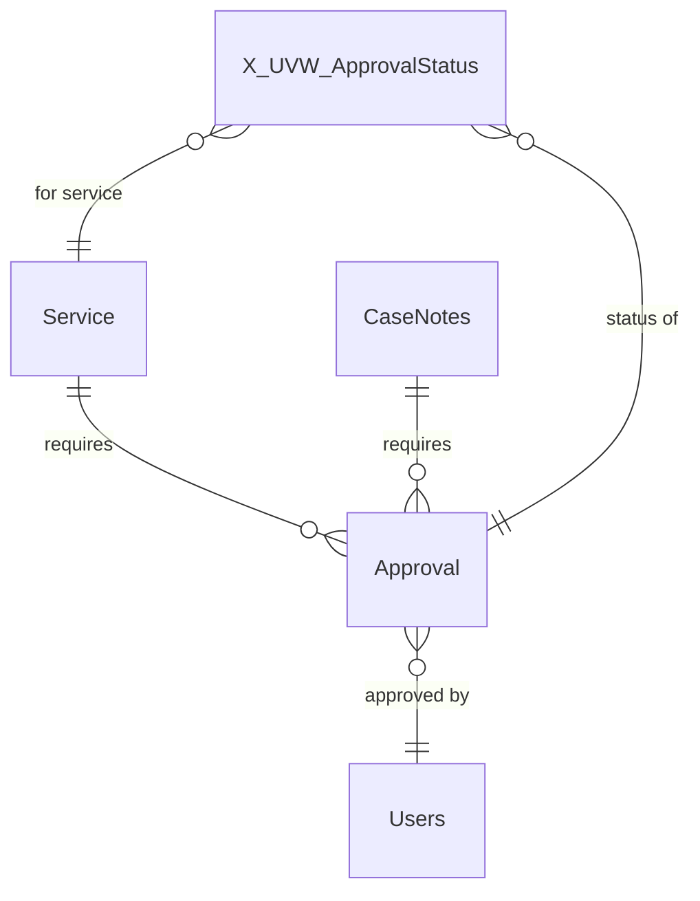
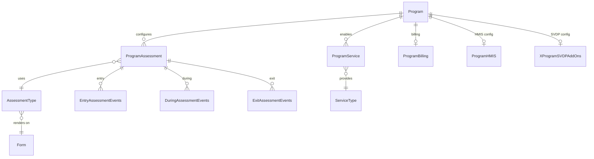
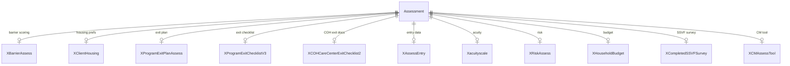

# CaseWorthy Entity Relationship Diagram

**Organization:** St. Vincent de Paul CARES
**Last Updated:** February 23, 2026

---

## Overview Diagram

This diagram shows the core entities and their relationships in the CaseWorthy database.

```mermaid
erDiagram
    %% ============================================
    %% CORE ENTITY HIERARCHY
    %% ============================================

    Entity ||--o| Client : "extends"
    Entity ||--o| Provider : "extends"
    Entity ||--o| Users : "extends"

    Entity {
        int EntityID PK
        tinyint EntityTypeID
        nvarchar EntityName
        date DeletedDate
    }

    Client {
        int EntityID PK_FK
        nvarchar FirstName
        nvarchar LastName
        varchar SSN
        date BirthDate
        int Gender
        tinyint Ethnicity
        tinyint VeteranStatus
    }

    Provider {
        int EntityID PK_FK
        nvarchar ProviderName
        nvarchar Address
        nvarchar City
        char State
    }

    Users {
        int EntityID PK_FK
        varchar UserName
        bit isActive
        int DefaultRoleID
        int SupervisorUserID
    }

    %% ============================================
    %% FAMILY STRUCTURE
    %% ============================================

    Family ||--|{ FamilyMember : "has"
    Client ||--o{ FamilyMember : "belongs to"

    Family {
        int FamilyID PK
        nvarchar FamilyName
        int FamilyPrimaryLang
    }

    FamilyMember {
        int FamilyMemberID PK
        int FamilyID FK
        int ClientID FK
        int RelationToHoH
        bit IsDependent
    }

    %% ============================================
    %% PROGRAM & ENROLLMENT
    %% ============================================

    Program ||--|{ Enrollment : "has"
    Program ||--o| ProgramHMIS : "has"
    Program ||--o{ ProgramAccount : "funded by"
    Account ||--o{ ProgramAccount : "funds"

    Program {
        int ProgramID PK
        nvarchar ProgramName
        bit EnrollmentsEnabled
        int AutoExitDays
    }

    ProgramHMIS {
        int ProgramID PK_FK
        int ProgramType
        nvarchar COCCode
        int BedInventory
    }

    Account {
        int AccountID PK
        nvarchar AccountName
        nvarchar FunderName
        money FiscalYearTotal
    }

    Enrollment ||--|{ EnrollmentMember : "includes"
    Enrollment ||--o| EnrollmentHMIS : "HMIS data"
    Enrollment ||--o{ XEnrollmentReview : "reviewed via"
    Client ||--o{ EnrollmentMember : "enrolled via"
    Family ||--o{ Enrollment : "enrolled as"

    EnrollmentHMIS {
        int EnrollmentID PK_FK
        date MoveInDate
    }

    Enrollment {
        int EnrollmentID PK
        int ProgramID FK
        int FamilyID FK
        int AccountID FK
        date BeginDate
        date EndDate
        tinyint Status
    }

    EnrollmentMember {
        int MemberID PK
        int EnrollmentID FK
        int ClientID FK
        tinyint RelationToHoH
        date BeginDate
        date EndDate
    }

    %% ============================================
    %% ASSESSMENTS
    %% ============================================

    Enrollment ||--o{ Assessment : "has"
    Client ||--o{ Assessment : "assessed"
    Assessment ||--o| AssessHUDProgram : "has"
    Assessment ||--o| AssessHUDUniversal : "has"
    Assessment ||--o| Xacuityscale : "has"
    Assessment ||--o| XAssessEntry : "has"

    Assessment {
        int AssessmentID PK
        int ClientID FK
        int EnrollmentID FK
        tinyint AssessmentEvent
        datetime BeginAssessment
    }

    AssessHUDProgram {
        int AssessmentID PK_FK
        int ExitDestination
        int HousingStatus
        tinyint Veteran
        tinyint DisablingCondition
    }

    AssessHUDUniversal {
        int AssessmentID PK_FK
        tinyint HousingStatus
        int PriorResidence
        int ChronicallyHomeless
    }

    Xacuityscale {
        int AssessmentID PK_FK
        int X_AcuityTotal
        nvarchar X_AcuityLevel
    }

    %% ============================================
    %% SERVICES & PAYMENTS
    %% ============================================

    Client ||--o{ Service : "receives"
    Provider ||--o{ Service : "provides"
    Enrollment ||--o{ Service : "linked to"
    ServiceType ||--o{ Service : "categorizes"
    Service ||--o{ ServicePayment : "paid via"

    Service {
        int ServiceID PK
        int ProvidedToEntityID FK
        int EnrollmentID FK
        int ServiceTypeID FK
        money ServiceTotal
        datetime BeginDate
    }

    ServiceType {
        int ServiceTypeID PK
        nvarchar Description
        money UnitValue
    }

    ServicePayment {
        int PaymentID PK
        int ServiceID FK
        money PaymentAmount
        datetime PaidDate
    }

    %% ============================================
    %% CASE NOTES
    %% ============================================

    Client ||--o{ CaseNotes : "has"
    Enrollment ||--o{ CaseNotes : "documented in"
    CaseNotes ||--o| CaseNotesExtension : "extends"
    CaseNotes ||--o{ AddendumNotes : "has addenda"

    CaseNotes {
        int CaseNoteID PK
        int EntityID FK
        int EnrollmentID FK
        nvarchar Body
        int CaseNoteTypeID
    }

    CaseNotesExtension {
        int CaseNoteID PK_FK
        int ContactType
        int X_CMToolCAT
    }

    AddendumNotes {
        int CaseNoteID PK
        int MasterNoteID FK
        nvarchar Body
    }

    %% ============================================
    %% CASE MANAGER ASSIGNMENT
    %% ============================================

    Users ||--o{ CaseManagerAssignment : "assigned as"
    Client ||--o{ CaseManagerAssignment : "assigned to"
    Enrollment ||--o{ CaseManagerAssignment : "for"

    CaseManagerAssignment {
        int AssignmentID PK
        int UserID FK
        int ClientID FK
        int EnrollmentID FK
        datetime BeginDate
    }

    %% ============================================
    %% USER & ROLE STRUCTURE
    %% ============================================

    Entity ||--o| Organization : "extends"
    Users }o--|| RoleDefinition : "has role"
    UserRole }o--|| Users : "assigned to"
    UserRole }o--|| RoleDefinition : "grants"
    Impersonation }o--|| Users : "impersonator"
    UserSupervisorHistory }o--|| Users : "supervisor of"

    %% ============================================
    %% ENCOUNTERS & CONTACTS
    %% ============================================

    Encounter }o--|| Entity : "with"
    Encounter }o--|| EncounterType : "typed as"
    ContactLog }o--|| Encounter : "logs"

    %% ============================================
    %% RELEASE OF INFORMATION
    %% ============================================

    ROI }o--|| Entity : "for"

    %% ============================================
    %% WAITLIST
    %% ============================================

    XBeforeScreeningWaitList }o--|| Entity : "waitlisted"

    %% ============================================
    %% APPROVALS
    %% ============================================

    Approval }o--|| Users : "approved by"

    %% ============================================
    %% PROGRAM CONFIGURATION
    %% ============================================

    ProgramAssessment }o--|| Program : "configures"
    ProgramAssessment }o--|| AssessmentType : "uses"
    AssessmentType }o--|| Form : "renders on"
    ProgramService }o--|| Program : "enables"
    ProgramService }o--|| ServiceType : "provides"
    ProgramBilling ||--|| Program : "billing for"

    %% ============================================
    %% SERVICE EXTENSIONS
    %% ============================================

    ServiceExtension ||--|| Service : "extends"
    XServiceSVDPAddOns }o--|| Enrollment : "projects for"

    %% ============================================
    %% ADDITIONAL ASSESSMENT EXTENSIONS
    %% ============================================

    XBarrierAssess ||--|| Assessment : "barriers"
    XClientHousing ||--|| Assessment : "housing prefs"
    XProgramExitPlanAssess ||--|| Assessment : "exit plan"
    XProgramExitChecklistV3 ||--|| Assessment : "exit checklist"
    XCOHCareCenterExitChecklist2 ||--|| Assessment : "COH exit docs"
```

---

## Detailed Relationship Diagrams

### Client & Family Structure

```mermaid
erDiagram
    Entity ||--|| Client : "1:1"
    Client ||--o{ FamilyMember : "member of"
    Family ||--|{ FamilyMember : "contains"
    Client ||--o{ ClientAddress : "has addresses"
    Client ||--o| ClientSummaryInfo : "has summary"
    Client ||--o| EntityVeteranInfo : "veteran info"
    Client ||--o{ EntityContactPreference : "contact prefs"

    Client {
        int EntityID PK
        nvarchar FirstName
        nvarchar LastName
        varchar SSN
        date BirthDate
        int Gender
        tinyint Ethnicity
        int Race
        tinyint VeteranStatus
        int MaritalStatus
        int PrimaryLanguage
    }

    Family {
        int FamilyID PK
        nvarchar FamilyName
    }

    FamilyMember {
        int FamilyMemberID PK
        int FamilyID FK
        int ClientID FK
        int RelationToHoH
        bit IsDependent
        bit ISLivingWithHhld
    }

    ClientAddress {
        int AddressID PK
        int ClientID FK
        nvarchar Address1
        varchar City
        char State
        char ZipCode
        date BeginDate
        date EndDate
    }

    EntityVeteranInfo {
        int EntityID PK_FK
        tinyint VetBranch
        tinyint VetServiceEra
        tinyint VetDischargeStatus
        int ServiceConnectedDisability
    }

    ClientSummaryInfo {
        int ClientID PK_FK
        datetime DateOfDeath
        int PregnancyStatus
        int Employed
    }
```

### Enrollment Flow

```mermaid
erDiagram
    Program ||--|{ Enrollment : "has enrollments"
    Program ||--o| ProgramHMIS : "HMIS config"
    Program ||--o| XProgramSVDPAddOns : "SVDP config"
    Program ||--o{ PlanTypeProgram : "plan types"

    Enrollment ||--|{ EnrollmentMember : "members"
    Enrollment ||--o| EnrollmentHMIS : "HMIS data"
    Enrollment ||--o{ XEnrollmentReview : "reviews"
    Enrollment ||--o{ Assessment : "assessments"
    Enrollment ||--o{ Service : "services"
    Enrollment ||--o{ CaseNotes : "notes"
    Enrollment ||--o{ EnrollmentServicePlan : "plans"
    Enrollment ||--o| XSVdPEnrollmentSummary : "summary"

    Client ||--o{ EnrollmentMember : "enrollments"

    Program {
        int ProgramID PK
        nvarchar ProgramName
        int FamilyOrIndividual
        int AutoExitDays
        int MinDays
        int MaxDays
    }

    ProgramHMIS {
        int ProgramID PK_FK
        int ProgramType
        int BedInventory
        int UnitInventory
    }

    Enrollment {
        int EnrollmentID PK
        int ProgramID FK
        int FamilyID FK
        int AccountID FK
        date BeginDate
        date EndDate
        tinyint Status
    }

    EnrollmentMember {
        int MemberID PK
        int EnrollmentID FK
        int ClientID FK
        int ProviderID FK
        tinyint RelationToHoH
        date BeginDate
        date EndDate
    }

    EnrollmentHMIS {
        int EnrollmentID PK_FK
        date MoveInDate
    }

    XEnrollmentReview {
        int XEnrollmentReviewID PK
        int EnrollmentID FK
        int X_ReviewStatus
        int X_ReviewType
        bit X_PQIReviewed
    }

    EnrollmentServicePlan {
        int EnrollmentServicePlanID PK
        int EnrollmentID FK
        int ClientID FK
        int CaseManagerID FK
        int X_Phase
        date PlanBeginDate
        date PlanEndDate
    }
```

### Assessment Structure

```mermaid
erDiagram
    Assessment ||--o| AssessHUDProgram : "HUD Program data"
    Assessment ||--o| AssessHUDUniversal : "HUD Universal data"
    Assessment ||--o| Xacuityscale : "Acuity scores"
    Assessment ||--o| XAssessEntry : "Entry data"
    Assessment ||--o| XRiskAssess : "Risk assessment"
    Assessment ||--o| XAssessExit : "Exit data"
    Assessment ||--o| XAssessmentReview : "Review notes"
    Assessment ||--o| XHouseholdBudget : "Budget"
    Assessment ||--o{ AssessHealthInsurance : "Insurance"
    Assessment ||--o{ AssessFinancialItem : "Financials"

    Assessment {
        int AssessmentID PK
        int ClientID FK
        int EnrollmentID FK
        tinyint AssessmentEvent
        datetime BeginAssessment
        datetime EndAssessment
    }

    AssessHUDProgram {
        int AssessmentID PK_FK
        int ExitDestination
        int HousingStatus
        tinyint Veteran
        int DomesticViolence
        int SubstanceAbuse
        int MentalIllness
    }

    AssessHUDUniversal {
        int AssessmentID PK_FK
        tinyint HousingStatus
        int PriorResidence
        int ChronicallyHomeless
        tinyint DisablingCondition
    }

    Xacuityscale {
        int AssessmentID PK_FK
        int X_AcuityTotal
        nvarchar X_AcuityLevel
        int X_acuityquestionslivingsituation
        int X_acuityfinancial
        int X_acuitymental
    }

    XAssessEntry {
        int AssessmentID PK_FK
        int X_ClientType
        int X_LiterallyHomeless
        int X_HasVISPDAT
    }

    XRiskAssess {
        int AssessmentID PK_FK
        int X_YesNoSelfHarm
        int X_YesNoFeelUnsafe
        nvarchar X_SafetyActions
    }

    AssessFinancialItem {
        int FinancialItemID PK
        int AssessmentID FK
        int FinancialItemTypeID FK
        money Amount
    }
```

### Service & Financial Flow



### WAL (Work Activity Log) Structure



### Referral Tracking



### User & Role Structure



### Encounter & Contact Flow



### Release of Information



### Waitlist Flow



### Approval Workflow



### Program Configuration



### Additional Assessment Details



---

## Key Relationship Summary

| Parent Table | Child Table | Relationship | Join Column |
|--------------|-------------|--------------|-------------|
| **Entity Hierarchy** | | | |
| Entity | Client | 1:1 | EntityID |
| Entity | Provider | 1:1 | EntityID |
| Entity | Users | 1:1 | EntityID |
| **Family Structure** | | | |
| Family | FamilyMember | 1:N | FamilyID |
| Client | FamilyMember | 1:N | ClientID |
| **Enrollment** | | | |
| Program | Enrollment | 1:N | ProgramID |
| Family | Enrollment | 1:N | FamilyID |
| Enrollment | EnrollmentMember | 1:N | EnrollmentID |
| Client | EnrollmentMember | 1:N | ClientID |
| Enrollment | EnrollmentHMIS | 1:1 | EnrollmentID |
| Enrollment | XEnrollmentReview | 1:N | EnrollmentID |
| **Assessment** | | | |
| Enrollment | Assessment | 1:N | EnrollmentID |
| Client | Assessment | 1:N | ClientID |
| Assessment | AssessHUDProgram | 1:1 | AssessmentID |
| Assessment | AssessHUDUniversal | 1:1 | AssessmentID |
| Assessment | Xacuityscale | 1:1 | AssessmentID |
| Assessment | AssessFinancialItem | 1:N | AssessmentID |
| Assessment | XAssessExit | 1:1 | AssessmentID |
| Assessment | XBarrierAssess | 1:1 | AssessmentID |
| Assessment | XRiskAssess | 1:1 | AssessmentID |
| Assessment | XHouseholdBudget | 1:1 | AssessmentID |
| Assessment | XCompletedSSVFSurvey | 1:1 | AssessmentID |
| Assessment | XProgramExitPlanAssess | 1:1 | AssessmentID |
| **Services** | | | |
| Enrollment | Service | 1:N | EnrollmentID |
| ServiceType | Service | 1:N | ServiceTypeID |
| Service | ServicePayment | 1:N | ServiceID |
| **Case Notes** | | | |
| Client | CaseNotes | 1:N | EntityID |
| Enrollment | CaseNotes | 1:N | EnrollmentID |
| CaseNotes | CaseNotesExtension | 1:1 | CaseNoteID |
| CaseNotes | AddendumNotes | 1:N | MasterNoteID |
| **User & Role Structure** | | | |
| Organization | Entity | 1:1 extension | EntityID |
| RoleDefinition | Users | 1:Many (default role) | RoleID |
| UserRole | Users, RoleDefinition | Many:Many junction | UserID, RoleID |
| Impersonation | Users (x2) | Many:Many | UserID, ImpersonatorID |
| UserSupervisorHistory | Users (x2) | Many:Many | UserID, SupervisorID |
| EntityDemographic | Entity | 1:1 extension | EntityID |
| EntityContact | Entity (x2) | 1:Many | EntityID, ParentEntityID |
| **Encounters & Contacts** | | | |
| Encounter | Entity, EncounterType | Many:1 | EntityID, EncounterTypeID |
| ContactLog | Encounter, Entity (x2) | Many:1 | EncounterID, ProvidedByEntity, ProvidedToEntity |
| **Release of Information** | | | |
| ROI | Entity, Family, Provider | Many:1 | EntityID, FamilyID, ProviderID |
| **Waitlist** | | | |
| XBeforeScreeningWaitList | Entity | 1:Many | EntityID |
| X_UVW_EnrollmentsAfterWaitlist | XBeforeScreeningWaitList, Enrollment | View | XBeforeScreeningWaitListID, EnrollmentID |
| X_UVW_DaysSinceWaitlist | XBeforeScreeningWaitList | View | XBeforeScreeningWaitListID |
| **Approvals** | | | |
| Approval | Users | Many:1 | UserID, ContextID (polymorphic) |
| **Program Configuration** | | | |
| ProgramAssessment | Program, AssessmentType | Many:Many junction | ProgramID, AssessmentTypeID |
| AssessmentType | Form | Many:1 | FormID |
| ProgramService | Program, ServiceType | Many:Many junction | ProgramID, ServiceTypeID |
| ProgramBilling | Program | 1:1 extension | ProgramID |
| **Service Extensions** | | | |
| ServiceExtension | Service | 1:1 extension | ServiceID |
| XServiceSVDPAddOns | Enrollment | 1:Many | EnrollmentID |
| **Additional Assessment Extensions** | | | |
| XAssessEntry | Assessment | 1:1 extension | AssessmentID |
| XClientHousing | Assessment | 1:1 extension | AssessmentID |
| XProgramExitChecklistV3 | Assessment | 1:1 extension | AssessmentID |
| XCOHCareCenterExitChecklist2 | Assessment | 1:1 extension | AssessmentID |
| XCMAssessTool | Assessment | 1:1 extension | AssessmentID |
| XAssessmentReview | Assessment | 1:1 extension | AssessmentID |
| **Views** | | | |
| X_UVW_MostRecentHousingStabilityPlan | Client, Enrollment | View | ClientID, EnrollmentID |
| uvw_ClientEnrollmentDays | EnrollmentMember | View | MemberID |
| X_UVW_MostRecentAcuity | Entity, Assessment | View | EntityID, AssessmentID |
| X_UVW_Latest90DayRecert | Entity, Assessment | View | ClientID, AssessmentID |
| X_UVW_Latest90DayRecertWEnroll | Entity, Enrollment, Assessment | View | ClientID, EnrollmentID, AssessmentID |
| UVW_EnrolledMemberCount | Enrollment, Program | View | EnrollmentID, ProgramID |
| UVW_FinancialTotal | Assessment, Entity | View | AssessmentID, ClientID |
| UVW_LatestCaseManager | Entity, CaseManagerAssignment | View | ClientID, AssignmentID |
| x_uvw_LatestUserByJobType | Entity, Enrollment | View | ClientID, EnrollmentID |
| UVW_IsServiceUsed | Service | View | ServiceID |
| **Miscellaneous** | | | |
| JobType | WorkHistory | 1:Many | JobTypeID |
| OrgGroup | OrgGroupMember | 1:Many | OrgGroupID |

---

## Important Notes

### Soft Delete Pattern
All tables use `DeletedDate` for soft deletes:
- `NULL` = Active record
- `12/31/9999` = Active (legacy convention)
- Any other date = Deleted on that date

### Client-Enrollment Relationship
**Clients do NOT link directly to Enrollment.** The relationship is:
```
Client → EnrollmentMember → Enrollment → Program
```

### Assessment Events
| Value | Meaning |
|-------|---------|
| 1 | At Entry |
| 2 | During (Update/90-Day Recert) |
| 3 | At Exit |

### Head of Household
- `RelationToHoH = 1` indicates Head of Household
- Most HUD validations only apply to HoH members
- HoH determines family-level data quality

---

## Viewing This Diagram

This ERD uses **Mermaid** syntax. To view it:

1. **GitHub/GitLab** — Renders automatically in markdown preview
2. **VS Code** — Install "Markdown Preview Mermaid Support" extension
3. **Mermaid Live Editor** — Paste code at https://mermaid.live
4. **Obsidian** — Native Mermaid support in preview mode
